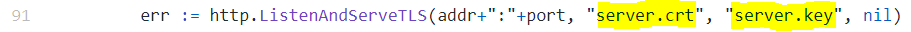

<p align="center">
  
</p>

# SigmaShooter

Shooter of Sigma rules to SIEM systems, Graylog in this first version.

# What is SigmaShooter

SigmaShooter is a repository web app to manage and run Sigma rules against SIEM systems. 

<p align="center">
  
</p>

In this first version, only Graylog SIEM is available to run rules on it. However, SigmaShooter can be executed in repository mode to manage your Sigma rules.

## Instaling SigmaShooter

1. Clone the repository:
```
$ git clone https://github.com/ppll0p1s/SigmaShooter.git
$ cd SigmaShooter/
```
2. Create certs to launch web server in HTTPS:
```
# Generate our private key
$ openssl genrsa -out server.key 2048
# And use it to generate web server cert
$ openssl req -new -x509 -sha256 -key server.key -out server.crt -days 3650
```
3. Fill cert names in line 91 of the file `web/router.go`:

<p align="center">
  
</p>

4. Compile the tool:
```
$ go build sigmaShooter.go
```
5. Configure `sigmaShooter.conf` file with your values.

6. Run SigmaShooter:
```
$ ./sigmaShooter
```
7. Enjoy! :)

## Featurs

* Repository of Sigma rules: create, move, delete, import, export.
* Sigma rules Conversion using sigmac and Execution to SIEM. (Graylog in this first version.)
* Alert Generation on SIEM configured. (Graylog in this first version.)
* Upload logs to SIEM option and Run Sigma rules to these logs from "Upload Logs" tab. (Windows Events Logs and Graylog in this first version.)
* API available to automate tasks. Options available list in the next section.

## API

  `/api/checkConn`              - GET : Return SIEM Connectivity state from the app
  `/api/upload`                 - POST : Upload Sigma rules from .tar.gz
  `/api/uploadSingleRule`       - POST : Upload Sigma rule from .yml
  `/api/download`               - GET : Download Sigma rules loaded in .tar.gz
  `/api/delete`                 - GET : Delete All sigma rules
  `/api/deleteRule`             - POST : Delete Sigma rule from id
  `/api/runRule/{days:int}`     - POST : Run Sigma rule from id
  `/api/runRule/{days:int}`     - GET : Run All Sigma rules
  `/api/testRules`              - GET : Test Sigma rules
  `/api/uploadWinToSiemAndRun`  - POST : Upload Windows Event Logs and Run Sigma rules to them

