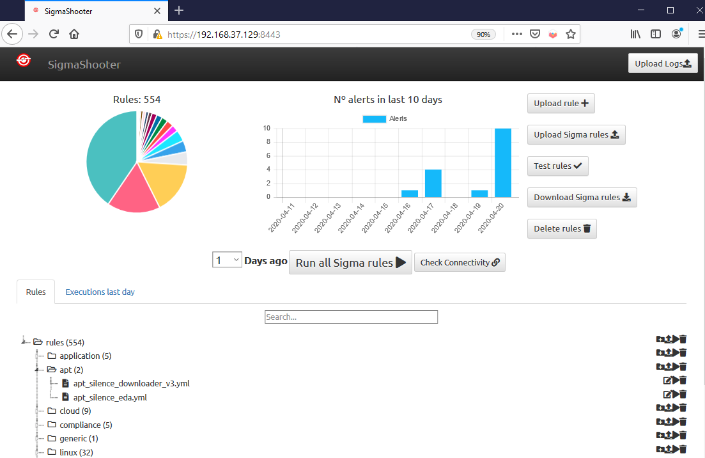

  

# SigmaShooter

Shooter of Sigma rules to SIEM systems.

# What is SigmaShooter

SigmaShooter is a repository web app to manage and run Sigma rules against SIEM systems. 

  

In this first version, only Graylog SIEM is available to run rules on it. However, SigmaShooter can be executed in repository mode to manage your Sigma rules.

## Instaling SigmaShooter

1. Clone the repository:

`$ git clone https://github.com/ppll0p1s/SigmaShooter.git`

2. Create certs to launch web server in HTTPS:

´# Generate our private key´
´$ openssl genrsa -out server.key 2048´
´# And use it to generate web server cert´
`openssl req -new -x509 -sha256 -key server.key -out server.crt -days 3650`
